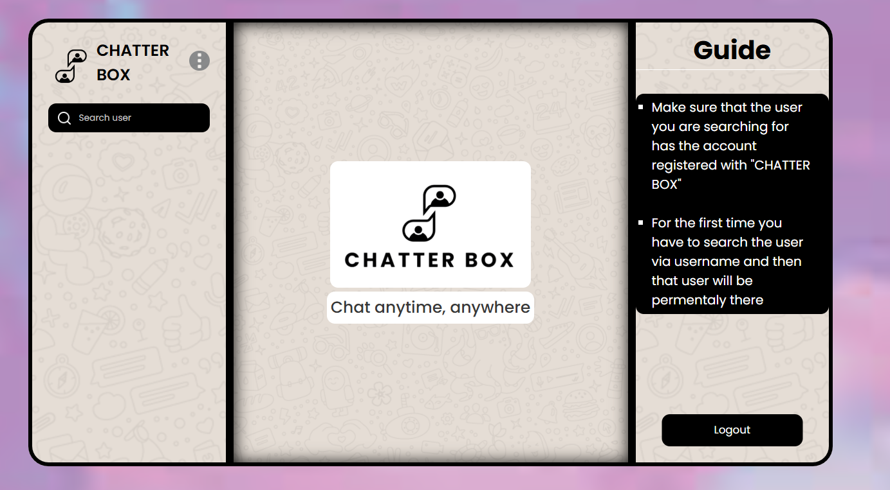

# Chatter Box

Chatter Box is a real-time chat application built using React.js and Firebase, providing users with a seamless and interactive messaging experience. It leverages Firebase Firestore for real-time message storage and synchronization, along with Firebase Authentication for secure user login.

## Features

- Instant messaging
- User friendly and very easy to use
- Cloud based storage
- Media sharing (Images can be send while chatting)
- Responsive UI


## Project Photos

- Sign Up/Login Page
[](https://katherineoelsner.com/)

- Landing Page
[](https://katherineoelsner.com/)

- Chat Messages
[](https://katherineoelsner.com/)

- Profile Update
[](https://katherineoelsner.com/)

- Password Reset Email
[](https://katherineoelsner.com/)

## Run Locally

Clone the project

```bash
  git clone https://github.com/NandishDPatel/Chatter-Box.git
```

Go to the project directory

```bash
  cd Chatter-Box
```

Install dependencies

```bash
  npm install
```

- After installing dependencies make sure to set your own firebase configuration and select the Blaze plan inside firebase to allow the feature of photo upload
- Set the follwing things inside /config/firebase.js file
```bash
  apiKey: "",
  authDomain: "",
  projectId: "",
  storageBucket: "",
  messagingSenderId: "",
  appId: "",
```
- You will get these after creating a project inside the firebase 

- [](https://katherineoelsner.com/)

- After setting up all the things now your project will be up and running by running the following command;

Start the server

```bash
  npm run dev
```

